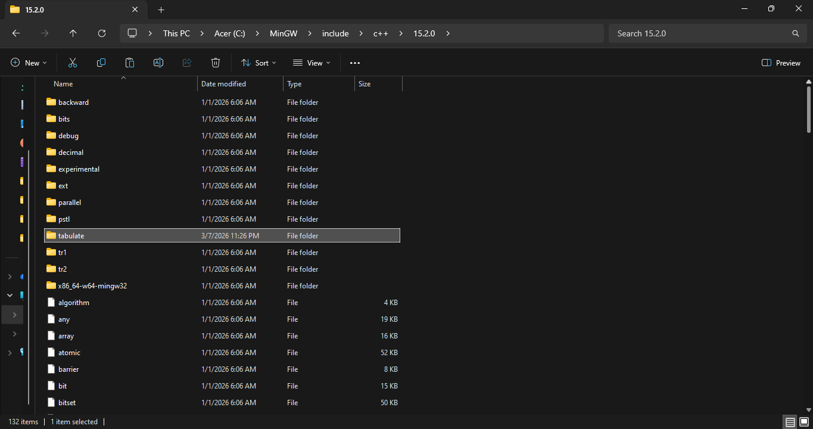
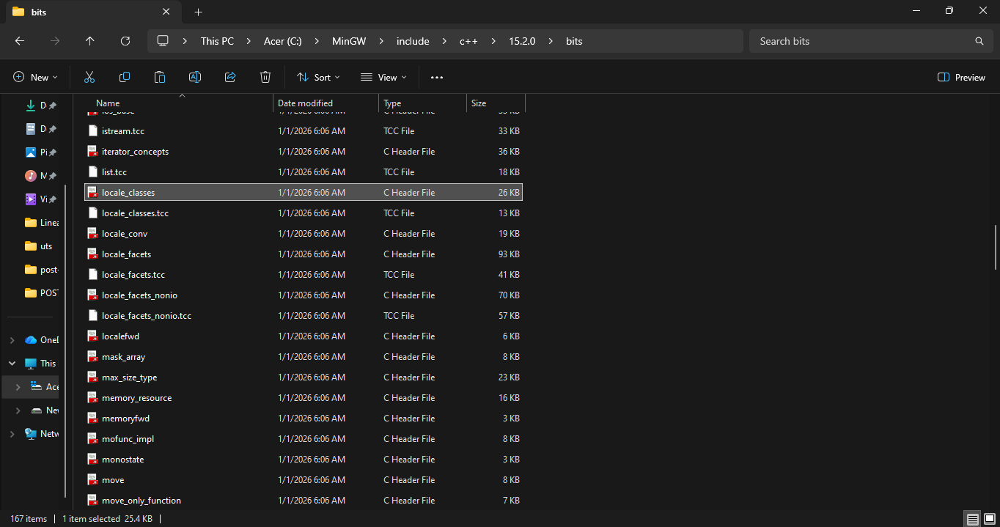

# Pendahuluan

Untuk Posttest 2 Struktur Data (dan mungkin Posttest-Posttest selanjutnya) saya akan menggunakan library _Tabulate_ untuk membuat tampilan Tabel agar lebih rapi. 

Jadi Sebelum memulai program, bisa mendownload terlebih dahulu file yang ada di Folder **prettyTable**. 

Didalam Folder terdapat dua file, yaitu: 
1. Folder **tabulate**; dan 
2. File _locale_classes.h_

Untuk Folder **Tabulate** bisa ditaruh pada directory compiler masing-masing (Bisa MinGW atau yang lain). Masukkan Folder ke **/includes/c++/versi_compiler_kalian** seperti gambar di bawah ini: 

Untuk File _locale_classes.h_ pada folder **/includes/c++/versi_compiler_kalian/bits**

